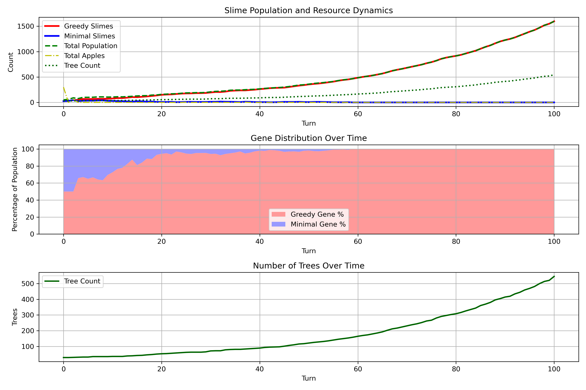
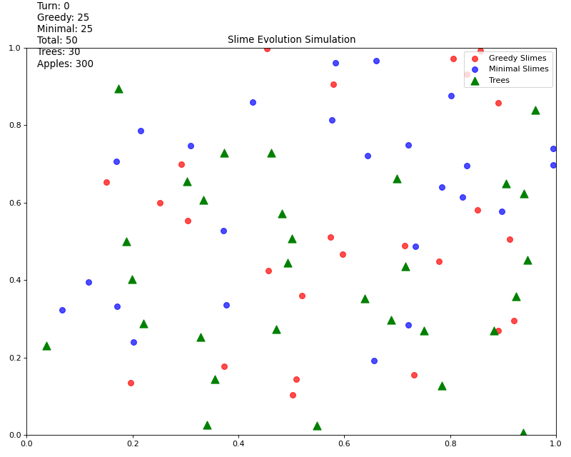
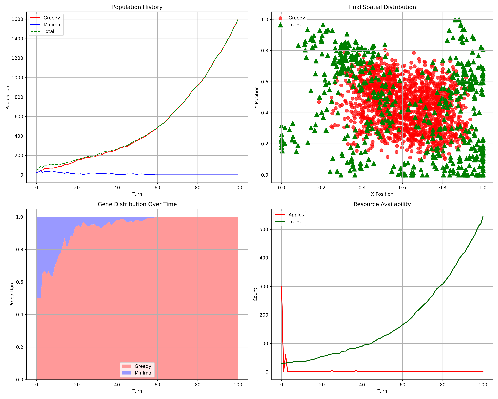

# Slime Evolution Simulation

A Python-based ecological simulation that models the competition between two genetic strategies in a population of virtual organisms called "slimes" competing for resources.



## Overview

This simulation explores evolutionary dynamics by modeling two competing genetic strategies:

- **Greedy Slimes (Red)**: Collect 10 apples at once and skip foraging in the next turn
- **Minimal Slimes (Blue)**: Collect only 5 apples each turn, always need to forage

Both types compete for limited apple resources that grow on trees scattered throughout the environment. The simulation tracks population dynamics, resource availability, and spatial distribution over time.

## Features

- **Dynamic Population Modeling**: Watch as slime populations evolve based on their genetic strategy and resource availability
- **Spatial Interaction**: Trees and slimes exist in a 2D environment where distance affects foraging opportunities
- **Genetic Competition**: Two competing genetic strategies battle for dominance
- **Resource Management**: Limited resources create selective pressure on the population
- **Tree Reproduction & Mortality**: Trees may spawn new trees nearby and die after a random lifespan, affecting ecosystem dynamics
- **Detailed Visualizations**:
  - Population trends over time
  - Gene distribution percentages
  - Spatial distribution of organisms and resources
  - Animated simulation playback (GIF and MP4)



## Requirements

- Python 3.6+
- Required libraries:
  - matplotlib
  - numpy
  - collections

## Usage

Run the simulation with default parameters:

```bash
python slime_simulation.py
```

You can customize the simulation by modifying these parameters at the top of the script:

```python
NUM_TREES = 30          # Number of trees (resources) in the environment
INITIAL_SLIMES = 50     # Starting population size
NUM_TURNS = 100         # Duration of the simulation
MAX_TREES = None        # Infinite trees allowed (or set a max integer)
TREE_REPRO_CHANCE = 0.03    # Probability for each tree to reproduce per turn
TREE_LIFESPAN_RANGE = (50, 150)  # Lifespan range for trees, in turns
```

## How It Works

### Entities

1. **Trees**: 
   - Generate 10 apples per turn
   - Can reproduce and spread to new locations
   - Have finite life spans (randomized per tree)
   - Are removed from the environment when they die

2. **Slimes**:
   - Move through the environment searching for trees with apples
   - Collect apples according to their genetic strategy
   - Need 5 apples per turn to survive
   - Reproduce when paired with another surviving slime

### Simulation Loop

Each turn follows this sequence:
1. Trees may reproduce (spawn new trees nearby)
2. Trees age, and may die if their lifespan is up
3. Trees produce new apples
4. Slimes search for and collect apples based on their genetic strategy
5. Slimes consume apples for survival (5 apples needed)
6. Surviving slimes randomly pair and reproduce
7. Statistics are recorded for visualization

### Output

The simulation produces:
- Population graphs showing the competition between genetic strategies
- Spatial distribution maps of slimes and resources
- GIF/MP4 animation of the entire simulation
- Final statistics summary, including number of trees and apples produced in the last turn



## Project Structure

- `Tree`: Class for resource-generating entities (with reproduction and finite lifespan)
- `Slime`: Class for organisms with genetic strategies
- `Simulation`: Main class handling the simulation logic and visualization

## Evolutionary Insights

This simulation demonstrates:
- How different resource acquisition strategies compete under selective pressure
- The importance of spatial distribution in ecological systems
- Population dynamics in response to limited resources
- The ecological effects of resource renewal and mortality
- Genetic drift and dominance in isolated populations

## License
[License](LICENSE)
